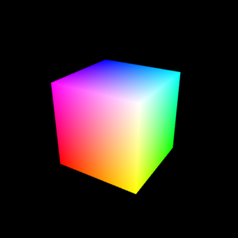

# Hola Cubo y Cámara

  

### Referencias 📚

- [WebGL 2 Fundamentals - Visualizing the Camera](https://webgl2fundamentals.org/webgl/lessons/webgl-visualizing-the-camera.html)
- [MDN - WebGL model view projection](https://developer.mozilla.org/en-US/docs/Web/API/WebGL_API/WebGL_model_view_projection)

### Uso 💻

Para correr el código, seguir las instrucciones de la sección **Usando los ejemplos** del repo [Recursos](https://github.com/computacion-grafica-uns/Recursos).
